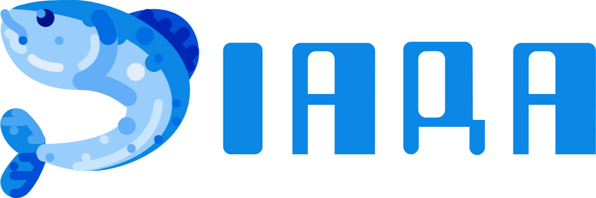
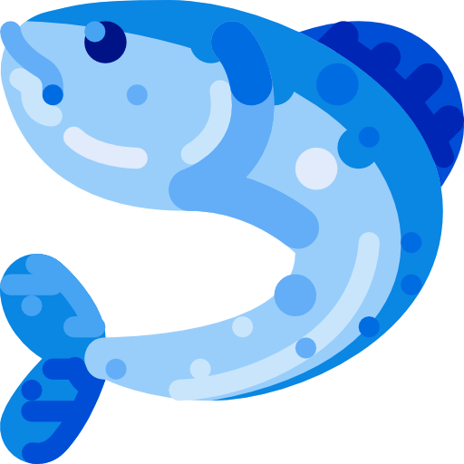

[![License: MIT][license-shield]][license-url]


<!-- PROJECT LOGO -->

<p align="center">  
  

  <p align="center">
    A fishing bot for an awesome MMO
    <br><strong>For educational purposes only!</strong>
  </p>
</p>

<!-- TABLE OF CONTENTS -->
<details open="open">
  <summary><h2 style="display: inline-block">Table of Contents</h2></summary>
  <ol>
    <li>
      <a href="#about-the-project">About The Project</a>
      <ul>
        <li><a href="#built-with">Built With</a></li>
        <li><a href="#technologies">Technologies</a></li>
      </ul>
    </li>
    <li>
      <a href="#getting-started">Getting Started</a>
      <ul>
        <li><a href="#prerequisites">Prerequisites</a></li>
        <li><a href="#installation">Installation</a></li>
      </ul>
    </li>    
    <li><a href="#usage">Usage</a></li>
    <li><a href="#contributing">Contributing</a></li>
    <li><a href="#license">License</a></li>
    <li><a href="#contact">Contact</a></li>    
  </ol>
</details>

<!-- ABOUT THE PROJECT -->
## About The Project

I had always been interested in learning Python and explore its capabilities with computer vision and automation so this project was a great hands-on introduction.

#### **The use of bots is forbidden in most games so use it at your own risk**
<br>

### Built With

* [Python](https://www.python.org/)

### Technologies
* pyautogui
* pyaudio
* audioop
* PyWin32
* keyboard
* dearpygui

<!-- GETTING STARTED -->
## Getting Started

To get a local copy up and running follow these simple steps.

### Prerequisites

* Python  
  [Download Python](https://www.python.org/downloads/)
  
### Installation

1. Clone the repo
   ```sh
   git clone https://github.com/totoledao/iara.git
   ```
2. Install dependencies
   ```sh
   pip install #something
   ```

<!-- USAGE EXAMPLES -->
## Usage

**Soon...**

<!-- CONTRIBUTING -->
## Contributing

I do not intend in maintaining or expanding this project, but feel free to contribute.

1. Fork the Project
2. Create your Feature Branch (`git checkout -b feature/AmazingFeature`)
3. Commit your Changes (`git commit -m 'Add some AmazingFeature'`)
4. Push to the Branch (`git push origin feature/AmazingFeature`)
5. Open a Pull Request

<!-- LICENSE -->
## License

Distributed under the MIT License. See [`LICENSE`][license-url] for more information.

 Icon made by [Adib Sulthon](https://www.flaticon.com/authors/adib-sulthon)

<!-- CONTACT -->
## Contact

Guilherme Toledo - guilherme-toledo@live.com

[](https://www.linkedin.com/in/guilhermemtoledo/)
[](https://www.facebook.com/totoledao)
[](https://www.instagram.com/totoledao)
[](https://www.github.com/totoledao)

Project Link: [https://github.com/totoledao/iara](https://github.com/totoledao/iara)

<!-- MARKDOWN LINKS & IMAGES -->
<!-- https://www.markdownguide.org/basic-syntax/#reference-style-links -->

[license-shield]: https://img.shields.io/badge/License-MIT-blue.svg
[license-url]: https://github.com/totoledao/iara/blob/main/LICENSE
[linkedin-shield]: https://img.shields.io/badge/-LinkedIn-black.svg?style=for-the-badge&logo=linkedin&colorB=0e76a8
[linkedin-url]: http://www.linkedin.com/in/guilhermemtoledo